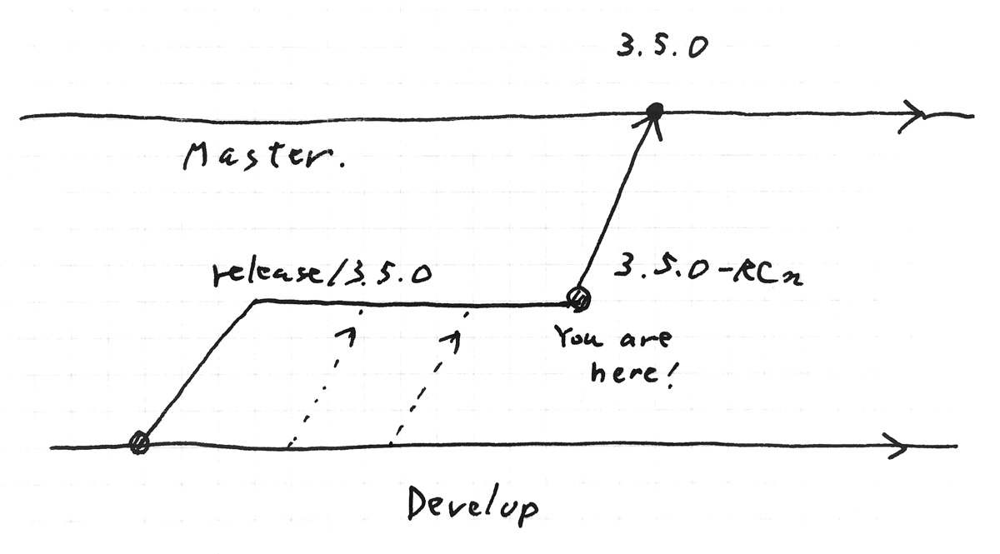

# Creating Cytoscape Release

Created on 2/7/2017
by Keiichiro Ono (kono ucsd edu)

## Introduction
This document is for core developers who need to create new release of Cytoscape.

#### System Requirements

* A Mac with latest OS (to sign DMG)
* Latest version of JDK 8
* Maven 3.x
* A text editor


## Case 1: Creating new Release branch from develop
(TBD)


## Case 2: Creating new RC from existing release branch

### Your Situation
You have Cytoscape 3.x RC n and want to create 3.x RC n+1

### Goal of this task
You have already created release branch before and have RC1 installers.  Now you need to create new replace candidate

#### Assumptions
* Current version: 3.x RC n
* Target version: 3.x RC n+1
* Release branch is already available in the remote repo.
* Release branch contains everything you need to create new RC.  This means all developers carefully cherry-picked all of the changes since the last RC.

### Step-by-Step Instruction

1. ```cd``` to your temp workspace (can be any of your local writable directory)
1. Run ```git clone https://github.com/cytoscape/cytoscape-scripts.git```
1. ```cd cytoscape-scripts/release-generator/create_next_rc```
1. Open ```workflow-create-next-rc.sh``` with your text editor
1. Edit version numbers.  For example, if you want to create Cytoscape 3.5.0 RC2 from RC1, the parameters are:
  * BRANCH="release/3.5.0"
  * CURRENT="3.5.0-RC1"
  * TARGET="3.5.0-RC2"
1. Save the modified script
1. Run the release workflow: ```./workflow-create-next-rc.sh```
1. Wait 10 minutes or so.

Now you have installers for all platforms in _build/cytoscape/gui-distribution/packaging/target/install4j_.  *Don't forget to sign DMG for Mac.*

## 3. Creating final release and merge back to master



This is the final step for the actual release and requires some Git branch management.

### Your Situation
You have Cytoscape 3.x RCn and want to create final release of 3.x

### Goal of this task
You have RC n installers.  Now you need to create final release for the Cytoscape 3.x.  In this case, you need to merge all changes to *master*.

#### Assumptions
* Current version: 3.x RCn
* Target version: 3.x
* Current 3.x RCn was created from the _release/3.x_ release branch
* Release branch contains everything you need to create final release.

### Step-by-Step Instruction

#### Automated Part
1. If you don't have _cytoscape-scripts_ repository in your local system, follow these steps.  Otherwise, skip to step 2.
  * ```cd``` to your temp workspace (can be any of your local writable directory)
  * Run ```git clone https://github.com/cytoscape/cytoscape-scripts.git```
1. ```cd cytoscape-scripts/release-generator/create-final-release```
1. Open ```workflow-create-final-release.sh``` with your text editor
1. Edit version numbers.  For example, if you want to create Cytoscape 3.5.0 from RC2, the parameters are:
  * BRANCH="release/3.5.0"
  * CURRENT="3.5.0-RC2"
  * TARGET="3.5.0"
1. Save the modified script
1. Run the release workflow: ```./workflow-create-final-release.sh```
1. Wait 10~20 minutes


#### Manual Tasks
* Make sure you are on the ***master*** branch
* Sign the DMG file for Mac
* Now you are ready to deploy the changes to remote.  For each local repository, run:
  * ```git push && git push --tags```
  * ```mvn deploy```
* Upload all of the core apps to the store and edit descriptions
* Upload installers to _chianti_
* Write release notes
* Update manual
* Update web site
* Done!
